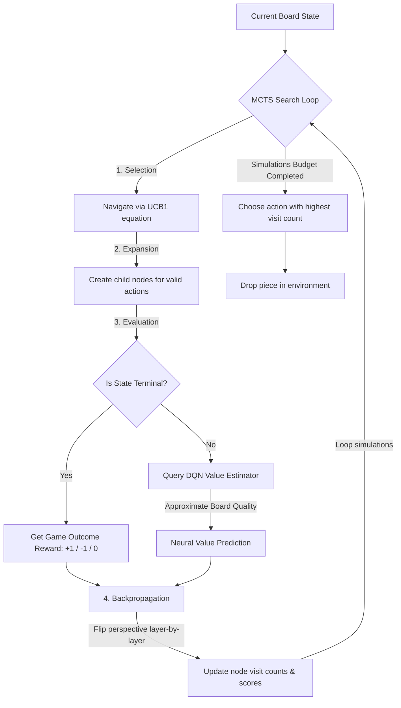

# 🎮 Connect Four: Neural-MCTS & Reinforcement Learning Engine

[](https://www.python.org/)
[](https://pytorch.org/)
[](https://www.pygame.org/)
[](https://github.com/astral-sh/uv)
[](https://opensource.org/licenses/MIT)

An advanced Connect Four artificial intelligence system built on the integration of **Monte Carlo Tree Search (MCTS)** and **Deep Q-Networks (DQN)**. Instead of relying on traditional, compute-heavy random rollouts to evaluate board states, this engine leverages a deep neural value estimator to predict optimal game pathways. 

The repository features a highly responsive **Pygame-based graphical user interface** with physics-based token drop animations, multi-threaded AI execution to avoid window lagging, and a comprehensive self-play training pipeline.

---

## 🏛️ Project Architecture & Workflow

The architecture blends classical search trees with deep reinforcement learning. Here is the operational loop of the decision engine:



### 🧠 Core Reinforcement Learning Innovations

1. **Neural State Evaluation (AlphaGo-Style)**: MCTS typically evaluates leaf nodes by playing out games randomly to the end (rollouts). In this project, we bypass rollouts entirely. The engine queries a trained **Double-DQN network** to predict the state's potential value directly, saving substantial computation and providing a much smarter search heuristic.
2. **Perspective Inversion**: To train a single network to play both sides of a zero-sum game, we normalize the board input. Before feeding the matrix to the neural net, we multiply the board array by the current player's token (`1` or `-1`). This ensures the DQN always evaluates the board from the perspective of *"I am Player +1, my opponent is -1"*.
3. **Action Masking**: In Connect Four, columns can fill up, making certain actions illegal. We implement strict action masking at both the DQN selection phase and the MCTS expansion phase. Invalid actions have their Q-values forced to $-\infty$, ensuring the network only evaluates and chooses legal moves.
4. **Double-DQN Stability**: During training, we use separate policy and target neural networks to compute temporal difference errors, reducing the overestimation bias common in standard Q-Learning.

---

## 📁 Repository Structure

The project follows a clean production-grade `src/` layout:

```text
connect_four_rl/
├── .gitignore              # Configured to track code and the small model binary
├── README.md               # Visual portfolio showcase documentation
├── pyproject.toml          # Modern UV dependency configuration
├── uv.lock                 # UV deterministic lockfile
├── main.py                 # Interactive master launcher script
├── connect4_dqn.pt         # Pre-trained double-DQN weights (~95 KB)
├── notebooks/
│   └── rough_notebook.ipynb# Exploratory scratchpad & draft training metrics
├── tests/
│   └── test_env.py         # Assertions verifying win detection and mechanics
└── src/
    ├── __init__.py
    ├── mcts.py             # MCTS search tree traversal and DQN evaluation
    ├── play.py             # CLI terminal player loop
    ├── play_gui.py         # Pygame high-fidelity visual interface
    ├── train.py            # Self-play reinforcement learning pipeline
    ├── agents/
    │   ├── __init__.py
    │   └── agents.py       # DQNAgent and neural network MLP architectures
    └── environment/
        ├── __init__.py
        └── env.py          # Production Connect Four environment tracker
```

---

## 🚀 Getting Started

### Prerequisites

You need Python 3.12 or newer. We recommend using **`uv`**, the ultra-fast Python package installer and manager, which handles environment setup automatically.

#### Option A: Using `uv` (Recommended)
You do not need to pre-create virtual environments or manually install dependencies. Simply run the launcher:
```bash
uv run main.py
```

#### Option B: Using standard `pip` & virtual environment
```bash
# 1. Create a virtual environment
python3 -m venv .venv
source .venv/bin/activate  # On Windows, use `.venv\Scripts\activate`

# 2. Install dependencies
pip install -r <(uv pip compile pyproject.toml)  # Or install numpy, pygame, torch manually
# Or simply:
pip install numpy pygame torch

# 3. Run the launcher
python main.py
```

#### Option C: Using the `Makefile` (Fastest)
If you have `make` installed on your system, you can launch specific modes directly from the project root:
```bash
make run      # Start the interactive console launcher
make play     # Play game visually (Pygame GUI) - RECOMMENDED
make play-cli # Play game in terminal (CLI)
make train    # Run self-play agent training (DQN learning)
make test     # Execute environment verification tests
make clean    # Clear Python __pycache__ folders
```

---


## 🎮 Interactive Console Launcher

When running `main.py`, you are presented with an interactive console to choose your operational mode:

```text
============================================================
      🎮 CONNECT FOUR NEURAL-MCTS & RL ENGINE 🎮      
============================================================
Select one of the following execution modes:
  [1] Play Game Visually (Pygame GUI)  <-- RECOMMENDED
  [2] Play Game in Terminal (CLI)
  [3] Run Self-Play Agent Training (DQN learning)
  [4] Execute Environment Verification Tests
------------------------------------------------------------
Enter choice (1-4, default=1): 
```

### 1. Pygame GUI Play Mode (Choice `1`)
Launches the dark-themed game window. 
- **Column Hover Preview**: Hovering the cursor over the board shows a transparent ghost preview of your piece at its destination.
- **Fluid Gravity Drops**: Dropping pieces features a smooth acceleration animation that bounces slightly upon hitting the column stack.
- **Non-blocking Search**: The MCTS search runs in a background worker thread. The GUI updates at a lockstep 60 FPS while displaying a glowing "AI planning..." status.
- **Winning Highlights**: Once a connection is made, the game draws a neon green vector line through the winning 4-in-a-row combination.

### 2. Terminal CLI Play Mode (Choice `2`)
Runs the classic text representation in your terminal (`X` vs. `O`), allowing you to test moves using key inputs directly.

### 3. Agent Training Loop (Choice `3`)
Trains the DQN policy by playing against itself. You can customize the number of episodes and update frequencies. On completion, weights are automatically saved to `connect4_dqn.pt`.

---

## 🔬 Mathematical Formulas

### Selection: UCB1 Equation
 MCTS selects search paths by balancing **exploitation** (visiting known good paths) and **exploration** (trying under-visited paths) via the Upper Confidence Bound 1 (UCB1) formula:

$$\text{UCB1}(c_i) = \frac{V_i}{N_i} + C_e \times \sqrt{\frac{\ln(N_p)}{N_i}}$$

Where:
- $V_i$: Total cumulative state value of child node $i$.
- $N_i$: Number of visits to child node $i$.
- $N_p$: Number of visits to the parent node.
- $C_e$: Exploration constant (set to $\sqrt{2} \approx 1.414$ by default).

---

## 🤝 Showcase Presentation

This project was built to illustrate the integration of classical tree searches with modern deep learning representations. Feel free to clone, star, or showcase it in your portfolio! If you share it on LinkedIn, tag the project as a demonstration of deep reinforcement learning for zero-sum turn-based strategy games.
